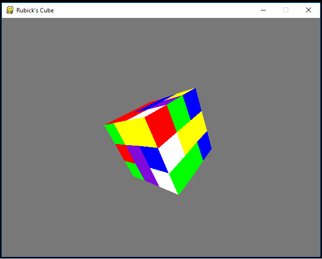

# rubiks_cube
My hello world to python - Rubik's cube solved using A-star algorithm

https://en.wikipedia.org/wiki/A*_search_algorithm
### The cube is both: 
1.Playable with the keyboard keys  
2. solvable with the push of a button which triggers the A-star algorithm, which makes use of a modular hueristic funtion

